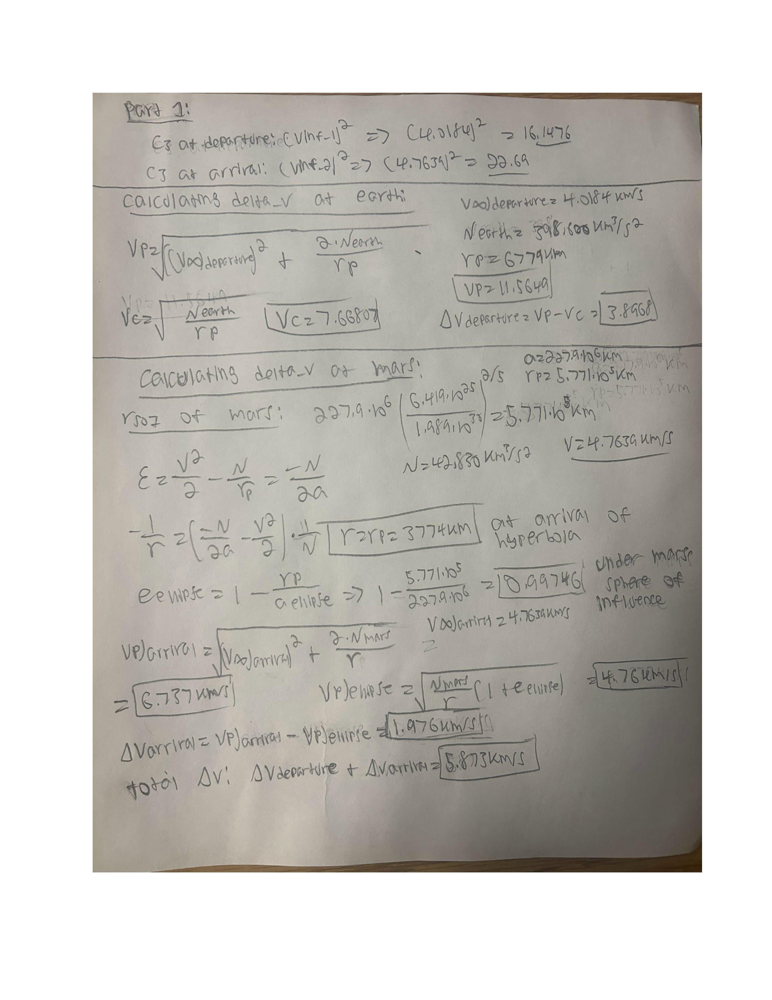
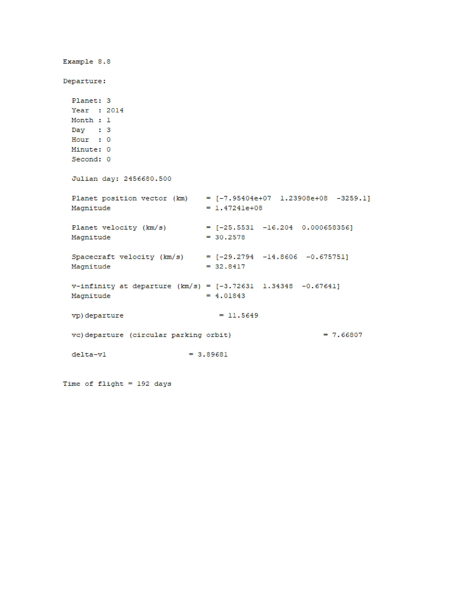
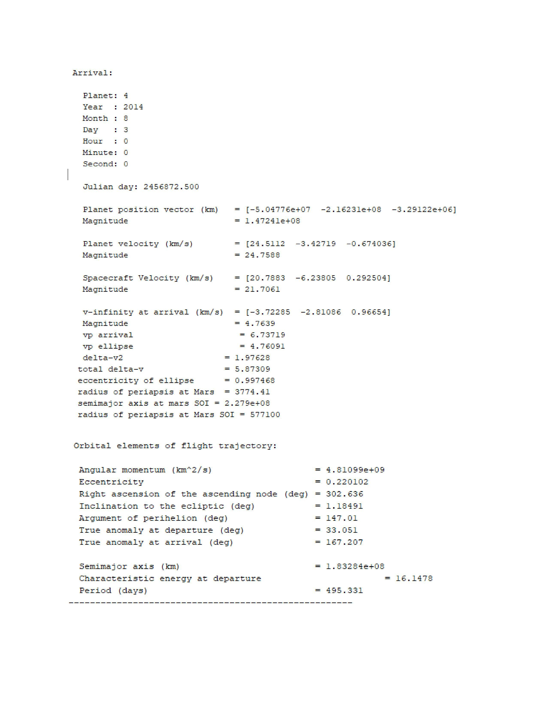

## ABOUT ME

Hello! I'm Edward Crabbe, a recent Mechanical Engineering Graduate at Lehigh University, and i'm looking for experiences in controls, astrodynamics, and Computer Aided Design.

## MY PORTFOLIO
* A glimpse of some of the projects I've been working on.* 

## Projects

### Project 1: MATLAB Analysis
- **Description:** MATLAB project analyzing data with scripts and visualizations.

### Project 2: CAD project
- **Description:** created a toy car for a manufacturing project
- 
